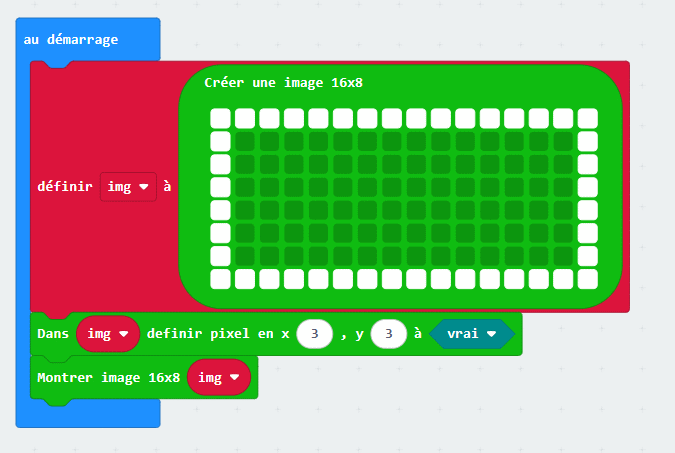

# LED Matrix 16x8 Controller for Micro:bit

Welcome to the 16x8 LED Matrix project !
This MakeCode Micro:bit extension enables easy control of a 16x8 LED matrix to draw anything you want on it.

## Features

Create images variables or clone it to manipulate multiple buffers.
Individual LED control.
Easy configuration via the MakeCode interface.
Fully available in english and in French (original language)

## Installation

Open the MakeCode for Micro:bit editor.
Click on the gear icon in the top right corner and select Extensions.
Paste the URL of this repository into the search bar (https://github.com/lgm42/microbit_leds-16x8-v2).
Select the extension to add it to your project.

## Basic Example

```typescript
let img = leds16x8.createImage(`
    # # # # # # # # # # # # # # # #
    # . . . . . . . . . . . . . . #
    # . . . . . . . . . . . . . . #
    # . . . . . . . . . . . . . . #
    # . . . . . . . . . . . . . . #
    # . . . . . . . . . . . . . . #
    # . . . . . . . . . . . . . . #
    # # # # # # # # # # # # # # # #
    `)
leds16x8.setPixel(img, 3, 3, true)
leds16x8.showImage(img)

```



## Extended example

## Hardware Requirements

A Micro:bit board.
A compatible 16x8 LED matrix.
Connection cables or a compatible driver board.

## Contributing

Contributions are welcome!
Please submit a pull request or open an issue if you have ideas or encounter any problems.

## License

This project is licensed under the MIT License.
